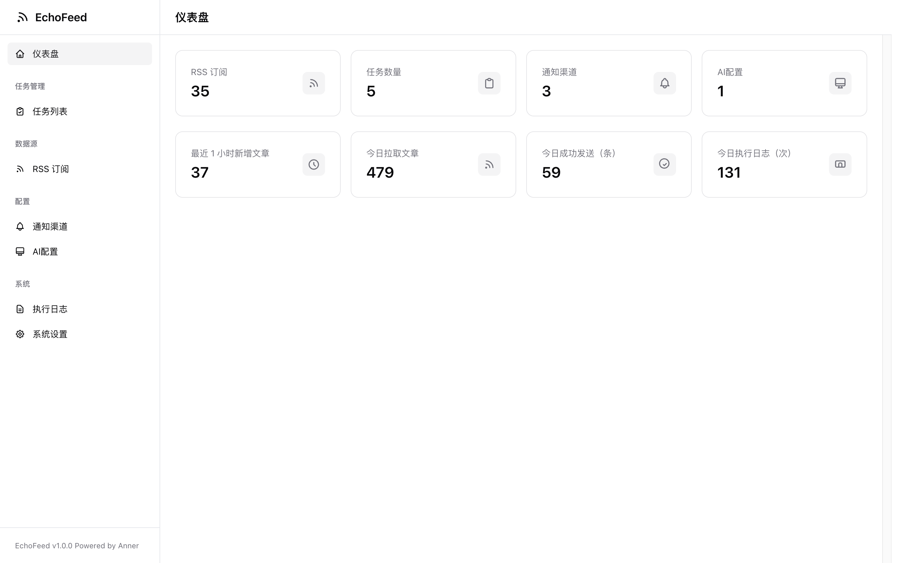
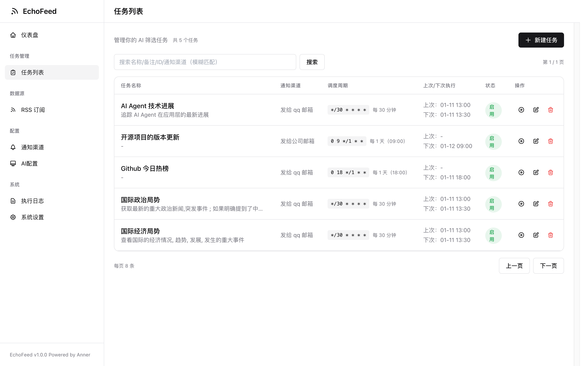
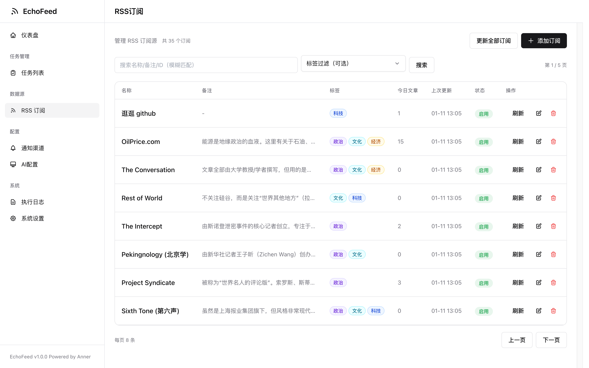
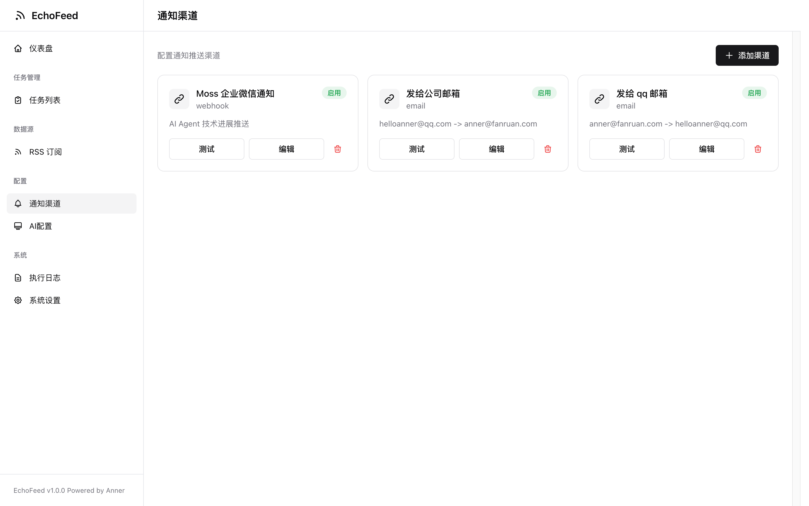
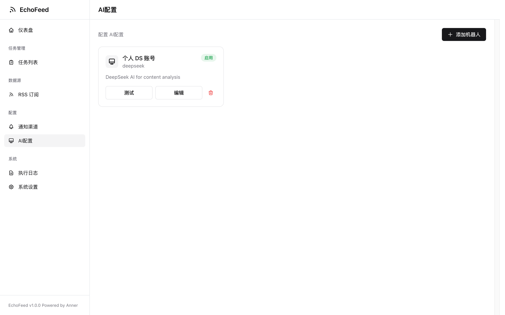
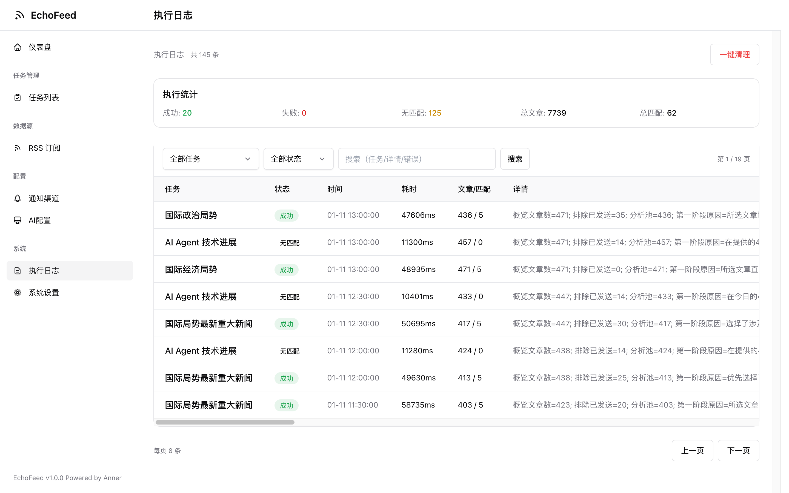
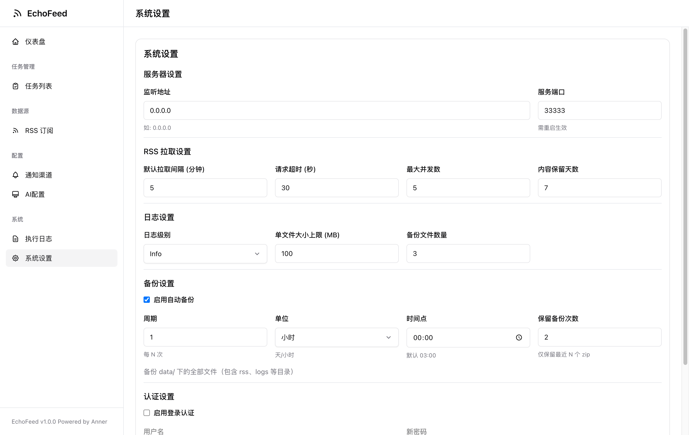

# EchoFeed

一个自托管的 RSS 聚合与 AI 筛选推送工具：定时拉取 RSS → 任务按提示词筛选 → 通过通知渠道推送（支持企业微信机器人）。

English README: `README.md`

## 功能

- RSS 订阅管理与定时拉取
- 任务：按关键词/提示词筛选内容，控制最低重要性
- 推送：企业微信/Webhook/Telegram/Email/Bark
- 任务级去重：同一任务不会重复推送同一篇文章
- Web UI：配置与管理（任务/订阅/渠道/机器人/日志）

## 快速启动（Docker）

前置：已安装 Docker + Docker Compose。

```bash
make start
```

访问：
- `http://localhost:33333`

常用命令：
```bash
make restart
make stop
```

## Web UI 截图

以下截图来自本地启动后的 Web UI（`http://localhost:33333` / `http://127.0.0.1:33333`），按左侧边栏入口逐一展示，方便快速了解各功能页面。

### 仪表盘

- 核心指标概览（订阅/任务/渠道/机器人）与近期动态（新增文章、拉取、推送、执行次数等）。


### 任务列表

- 创建与管理筛选规则（关键词/提示词、最低重要性）以及任务级去重。


### RSS 订阅

- 新增/编辑 RSS 订阅；保存前会校验 URL 连通性与可解析性。


### 通知渠道

- 配置通知渠道；必须“测试并保存”，测试发送成功后才允许保存。


### AI配置

- 配置任务使用的 AI 机器人；必须“测试并保存”，通过测试后才允许保存。


### 执行日志

- 查看最近执行记录与错误详情，便于排查与审计。


### 系统设置

- 管理全局服务设置（如服务端配置与定时相关选项等）。


## 配置

配置文件默认在 `./data/`：
- `data/rss.toml`：RSS 源
- `data/tasks.toml`：任务
- `data/channels.toml`：通知渠道
- `data/bots.toml`：AI 机器人
- `data/settings.toml`：服务端口等
